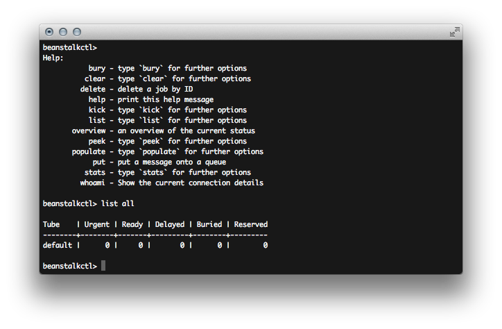

beanstalkctl
============

.. image:: https://travis-ci.org/OldhamMade/beanstalkctl.svg?branch=master
    :target: https://travis-ci.org/OldhamMade/beanstalkctl

A shell-like interface for interacting with beanstalkd.
Put, peek at, bury, and delete jobs, list tubes, and get
status information.

Commands
--------

``help``
  Print the help message

``overview``
  Show an overview of the current status of the beanstalkd server

``whoami``
  Show the current connection details

``stats full``
  Show all stats for the server
``stats short``
  Show useful stats for the server
``stats tube <tube>``
  Show stats for a tube

``list all``
  List all tubes
``list buried``
  List all tubes with buried jobs
``list delayed``
  List all tubes with delayed jobs
``list ready``
  List all tubes with ready jobs
``list reserved``
  List all tubes with reserved jobs
``list urgent``
  List all tubes with urgent jobs

``put <tube>``
  Put a message onto a queue

``peek buried``
  Peek at the next buried job on a tube
``peek id <id>``
  Peek at a specific job using it's id
``peek ready``
  Peek at the next ready job on a tube

``bury one <tube>``
  Bury the next ready job on a tube
``bury tube <tube>``
  Bury all jobs on a tube

``kick list``
  List all tubes with buried jobs
``kick one <tube>``
  Kick the next buried job on a tube
``kick tube <tube>``
  Kick all buried jobs on a tube
``kick everything``
  Kick all buried jobs from all tubes

``delete <id>``
  Delete a job by ID

``clear tube <tube>``
  Clear a tube of all jobs
``clear everything``
  Clear all tubes of all jobs

``populate tube <tube>``
  Populate a tube with random jobs
``populate tubes``
  Populate beanstalkd with random tubes and messages
